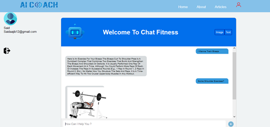

# Fitness Website - AI-Powered Exercise Recommendation System

A comprehensive fitness web application built with Flask that provides personalized exercise recommendations through an AI-powered chatbot, user management, fitness articles, workout plans, and an online store.


## Features

### 🤖 AI-Powered Chatbot

- **Text-based Exercise Recommendations**: Uses NLP (NLTK, TF-IDF) to understand user queries and recommend exercises
- **Image-based Exercise Demonstrations**: Returns GIF demonstrations of exercises for specific muscle groups
- **Natural Language Processing**: Implements cosine similarity and TF-IDF vectorization for intelligent query matching
- **Spell Correction**: Automatically corrects spelling errors in user input

### 👥 User Management

- User registration and authentication
- Session management
- Admin panel with CRUD operations for user management
- Role-based access control (admin/user)

### 📚 Content Pages

- **Home Page**: Main landing page with fitness information
- **Blog/Articles**: Multiple fitness articles (5 articles available)
- **Workout Plans**: Custom workout plan recommendations
- **Store**: Fitness merchandise and products
- **Chat Interface**: Interactive chatbot for exercise recommendations

### Exercise Database

- Comprehensive CSV database (`fitness_exercises.csv`) with exercise information
- Includes body parts, equipment, GIF URLs, and exercise descriptions
- Supports multiple muscle groups: quads, pectorals, biceps, triceps, abs, back, shoulders, legs, arms, and more

## Project Structure

```
.
├── main.py                  # Text-based chatbot response generator
├── mainIMG.py              # Image-based chatbot response generator
├── deployIMG.py            # Flask application (main server)
├── texttt.json             # Intent patterns for text chatbot
├── imgitt.json             # Intent patterns for image chatbot
├── fitness_exercises.csv   # Exercise database with GIF URLs
├── static/
│   ├── css/               # Stylesheets (Bootstrap, custom styles)
│   ├── js/                # JavaScript files (jQuery, Bootstrap, custom scripts)
│   ├── images/            # Images and assets
│   └── fonts/             # Web fonts
└── templates/
    ├── header.html        # Header template
    ├── footer.html        # Footer template
    ├── login.html        # Login page
    ├── register.html     # Registration page
    ├── user.html         # User dashboard
    ├── imgtest.html      # Home page
    ├── index2.html       # Admin panel
    ├── store.html        # Store page
    ├── plans.html        # Workout plans page
    ├── blogS.html        # Blog listing page
    ├── article1-5.html   # Individual article pages
    └── images/           # Template-specific images
```

## Technology Stack

### Backend

- **Flask**: Web framework
- **MySQL**: Database for user management
- **NLTK**: Natural Language Processing
- **scikit-learn**: TF-IDF vectorization and cosine similarity
- **pandas**: Data manipulation for exercise database
- **spellchecker**: Spell correction library

### Frontend

- **Bootstrap**: CSS framework
- **jQuery**: JavaScript library
- **HTML5/CSS3**: Markup and styling
- **JavaScript**: Client-side interactivity

## Installation

### Prerequisites

- Python 3.7+
- MySQL Server
- pip (Python package manager)

### Setup Steps

1. **Clone the repository**

   ```bash
   git clone <repository-url>
   cd "PFE V5/github repo"
   ```

2. **Install Python dependencies**

   ```bash
   pip install flask flask-mysqldb nltk scikit-learn pandas spellchecker
   ```

3. **Download NLTK data** (first time only)

   ```python
   import nltk
   nltk.download('punkt')
   nltk.download('stopwords')
   ```

4. **Configure MySQL database**

   - Create a MySQL database named `user_system`
   - Update database credentials in `deployIMG.py`:
     ```python
     app.config['MYSQL_HOST'] = 'localhost'
     app.config['MYSQL_USER'] = 'root'
     app.config['MYSQL_PASSWORD'] = 'your_password'
     app.config['MYSQL_DB'] = 'user_system'
     ```

5. **Create database table**

   ```sql
   CREATE TABLE users (
       userid INT AUTO_INCREMENT PRIMARY KEY,
       name VARCHAR(100) NOT NULL,
       email VARCHAR(100) UNIQUE NOT NULL,
       password VARCHAR(100) NOT NULL
   );
   ```

6. **Run the application**

   ```bash
   python deployIMG.py
   ```

7. **Access the application**
   - Open your browser and navigate to `http://localhost:5000`

## API Endpoints

### Chat Endpoints

- `POST /predictxt` - Get text-based exercise recommendations

  - Request: `{"message": "I want to train my biceps"}`
  - Response: `{"answer": "Exercise description..."}`

- `POST /predictimg` - Get image URL for exercise demonstration
  - Request: `{"message": "I want to train my biceps"}`
  - Response: `{"answer": "https://exercise-gif-url.com/..."}`

### User Management

- `GET /home` - Home page
- `GET /login` - Login page
- `POST /login` - User authentication
- `GET /register` - Registration page
- `POST /register` - User registration
- `GET /logout` - User logout
- `GET /chat` - Chat interface (requires login)

### Content Pages

- `GET /store` - Store page
- `GET /article` - Blog listing
- `GET /article2-5` - Individual articles
- `GET /plans` - Workout plans page

### Admin Panel

- `GET /panel` - Admin dashboard (admin only)
- `POST /insert` - Add new user
- `GET /delete/<id>` - Delete user
- `POST /update` - Update user information

## Configuration

### Chatbot Settings

- **Similarity Threshold** (text): 0.3 (in `main.py`)
- **Similarity Threshold** (image): 0.2 (in `mainIMG.py`)

### Intent Files

- `texttt.json`: Contains patterns and responses for text-based chatbot
- `imgitt.json`: Contains patterns and responses for image-based chatbot

## Usage

### For Users

1. Register a new account or login
2. Navigate to the chat page
3. Ask questions like:
   - "I want to train my biceps"
   - "What exercises can I do for my chest?"
   - "Recommend some leg exercises"
4. Receive text descriptions and/or GIF demonstrations

### For Administrators

1. Login with admin credentials
2. Access the admin panel at `/panel`
3. Manage users (create, read, update, delete)

## Data Files

- **fitness_exercises.csv**: Contains exercise data with columns:
  - `bodyPart`: Body part targeted
  - `equipment`: Equipment needed
  - `gifUrl`: URL to exercise demonstration GIF
  - `id`: Exercise ID
  - `name`: Exercise name
  - `target`: Target muscle group

## Development Notes

- The application uses Flask sessions for user authentication
- Admin role is determined by user role in the database
- The chatbot uses TF-IDF vectorization for semantic similarity matching
- Exercise recommendations are randomly selected from matching exercises in the database

## copyright
-DROUICH OUSSAMA ©2022
